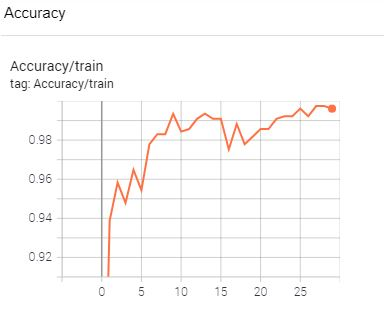
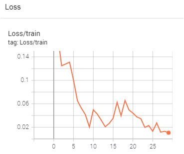

# PERIPHERAL-CENTRAL-fundus-classification
***
## Requirements
- Python >= 3.9

## Setup environment
Run this script to create a virtual environment and install dependency libraries
```bash
pip install -r requirements.txt
```
Set up: .csv,folder,tensorboard and download data
```bash
bash download_data.sh
```
## *<p style='color:cyan'>Edit training configuration in file config/config.json.</p>*
## Train
```bash
python train_cp.py
```
***
## Test
```bash
python test_cp.py
```
## *<p style='color:cyan'>Edit to-be-predicted file directory in file config/config.json.</p>*

## Predict
```bash
python predict_cp.py
```
***
We just have trained and not validated, because we could know the result by csv file which was created by predict_cp.py.

In the future, if you want to see the validation, you can change the value "TRAIN_VAL_SPLIT_STATUS" at config.json and then, you also can turn on early_stoping or checkpoint best_model mode on file train_cp.py("ealy stoping":use_checkpoint,"best_model":best_model)     
***

## Observe learning curve
```bash
tensorboard --logdir=log
```
| ACC | LOSS |
| ------------ | ------------- |
|  | |
***
Beside, you also can see [Accuracy, Precision, Recall, F1,Sensitivity,Specificity] on tensorboard

Initialation: 767 images train,epoch 30,batch_size=100,optimizer:adam,learning-rate=0.001,model: resnet18
Result training: 99.43% at epoch 30th, loss = 0.01438
Result prediction: 99% on 1301 image

## Agumentation
Each 3 epoch, dataloader will be transformed.
```python
image_transformation_2 = [
            transforms.Resize(image_size),
            transforms.RandomHorizontalFlip(p=0.6),
            transforms.RandomVerticalFlip(p=0.6)
        ]
``` 
## Crop
If the image belongs to CTEH, the image would be croped
```python
def check_size_crop_square(image):
    if image.shape[1] != image.shape[2]:

        if image.shape[1] < image.shape[2]:
            rateCrop=image.shape[1]
        else:
            rateCrop=image.shape[2]
        
        transforms_size = transforms.Compose([
        transforms.CenterCrop(size=[round(0.95*image.shape[1]),round(0.95*image.shape[2])]),
        transforms.CenterCrop(round(rateCrop*0.95))  
        ])

        tranformation = transforms_size(image)

    else: tranformation = image
        
    return tranformation
```
